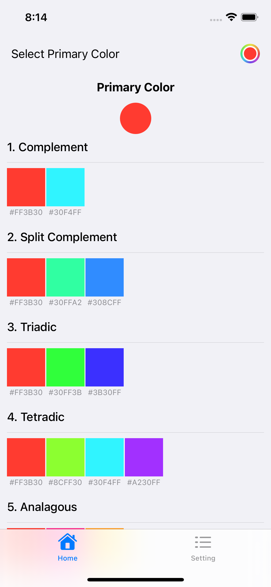

<h1 align="center">Hey there </h1>

### About Me :

I am a iOS Developer  from Taiwan currently base in Canada.

- 🔭 I’m working as a iOS Engineer and contributing to iOS open source.
- 🌱 Exploring Technical Content Writing.
- ⚡ In my free time I write code and read tech articles.
- 📫 How to reach me: &nbsp; 

---

### Currently work on 

1. [CTGauge](https://github.com/tsaihong1995/CTGauge)
2. [Wonderful Palette](https://github.com/tsaihong1995/WonderfulPalette)

Sneak peek of the project...

| 1. CTGauge  | 2. Colour palette |
| ------------- | ------------- |
|  |  |

---
### Recent Work :
- [DoorDash like ScrollView - SwiftUI](https://github.com/tsaihong1995/AnchorScrollView) 

- [Shimmer Effect in one line - SwiftUI](https://github.com/tsaihong1995/ShimmerEffect)

- [Sorting Method Visualizer - SwiftUI](https://github.com/tsaihong1995/SortingMethods) 

---

### 🛠 Languages and Tools :

&nbsp;
&nbsp;
&nbsp;
&nbsp;
&nbsp;          
&nbsp;

---

### 🔥 My Stats :

---

### ✍️ Blog Posts : 
- [(Swift) Using UNUserNotification to emit the notification in SwiftUI - Part 1](https://cartertsai.hashnode.dev/swift-using-unusernotification-to-emit-the-notification-in-swiftui-part-1)
- [(Swift) How I start my own app project as a self-taught developer?](https://cartertsai.hashnode.dev/swift-how-i-start-my-own-app-project-as-a-self-taught-developer)
- [(Swift) Save the Data to our Custom Model](https://cartertsai.hashnode.dev/swift-save-the-data-to-our-custom-model)

